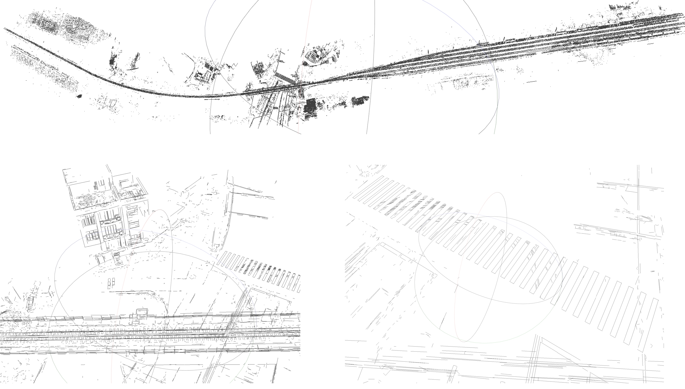

# 3D Line Reconstruction

Welcome to the public repository for our paper: *"Clustering, Triangulation, and Evaluation of 3D Lines in Multiple Images."* This repository features:

- Adaptive 3D line clustering for multi-view reconstruction.
- Robust triangulation with geometric consistency.


## Installation

- Use the `CMakeLists.txt` file in the `ELSRPP_MULTI` directory to compile the repository with CMake.
- VCPKG is recommended in Windows.
- Line matching is based on the approach described in the paper:  
  **"ELSR: Efficient Line Segment Reconstruction with Planes and Points Guidance," CVPR 2022.**  

### Test Platform

- **Operating System:** Windows 11
- **IDE:** Visual Studio 2022
- **Processor:** Intel i9-14900K
## Dependencies

- Third-Party Libraries:

  | Library Name | Version |
  | ------------ | ------- |
  | Boost        | 1.79.0  |
  | Eigen        | 3.4.0   |
  | OpenCV       | 4.5.5   |
  | OpenMP       |         |
  | TCLAP        | 1.4.0   |
  | NLOPT        | 2.7.1   |

## Usage with visual sfm (the support for pixel 4d is comming soon)
- The algorithm requires the SfM result file named `res.nvm` from either Photoscan or VisualSfM.
- Ensure that `res.nvm` is located in the image directory.
- Refer to the `example/Castle30` directory for sample input data.
- **Note that the nvm exported from Colmap is currently not well supported in our code.**  

### Command-Line Usage

```javascript
[3DLineResconstruction.exe] [-i] [inputfolder] [-l] [line extraction method] [-f] [line files extraction from other programs] [-e] [the file extension of the line files] [-c] [specifies whether the result comes from colmap] [-s] [the maximum size of input images] [-n] [the maximum number of input lines]
```

- **Input Folder `-i (std::string)`**

  Specifies the directory containing image files and the `res.nvm` file.

- **Line Extraction Method `-l (int)`**

  Defines the line segment extraction method. The program includes three methods: `LSD (OpenCV version)`, `AG3Line`, and `EDLine`, corresponding to options 1-3. If you want to use line segments obtained from other programs, you can just ignore this parameter or set it to -1.

- **Line Files Folder `-f (std::string)`**

  Specifies the directory path where the line segment files are stored. This parameter is required if the `-l` command is omitted or set to -1.

- **Line File Extension `-e (std::string)`**

  Used in conjunction with the `-f` command to identify the line files' extension. This command helps pair line files with images. For example, if the image file is `0001.jpg`, its line file should be `0001.jpg.line`, and set this to `.line`.

- **From ColMap `-c (int)`**

  If the `nvm` file originates from ColMap, specify this command as true,
  because we found a little difference between their coordinates.

- **Maximum Image Size `-s` and Maximum Line Number `-n`**

  These commands limit the maximum size of the input images and the maximum number of line segments. The default value is 99999, indicating no limit.

### Dataset
The public datasets used in the paper are as follows
- P25&Castle https://documents.epfl.ch/groups/c/cv/cvlab-unit/www/data/multiview/rawMVS.html
- Dublin https://geo.nyu.edu/catalog/nyu-2451-38684
- Internet (#0008, #5016, #0050, #0012, #0017, #0061) https://www.cs.cornell.edu/projects/megadepth/

### Example usage

```javascript
[3DLineReconstruction.exe] -i /yourPath/3DLineReconstruction/example/Castle30
/images/ -f /yourPath/3DLineReconstruction/example/Castle30
/lines/ -e .txt
```

### Result

<p align="center">
  
  
</p>


### Addition

If you want to use your line segment extraction results, keep the line segment storage format consistent with the example file. Each line segment detected from the image in the example file is stored in a separate line. The two endpoints of the line segment are stored as four numbers [x1 y1 x2 y2]  separated by spaces, and no other characters are required. 

### Recent reconstructions

<p align="center">
  <figure>
    
    <figcaption align="center">Reconstruct with 259 images (8192 ✖ 5460)</figcaption>
  </figure>
</p>

## License

The source code of 3D line reconstruction is released under [GPLv2](http://www.gnu.org/licenses/old-licenses/gpl-2.0.html) license. For commercial use, please contact us.
