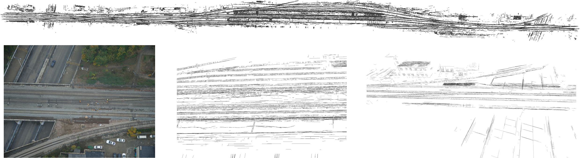

<!-- Row 1: 两张图 -->

  <table>
    <tr>
      <td align="center" width="45%">
        
      </td>
      <td align="center" width="45%">
        
      </td>
    </tr>
    <tr>
      <td colspan="2" align="center">
        <b>Reconstruct with 30 images (3072 ✖ 2048) Line detector-LSD </b>
      </td>
    </tr>
  </table>

<!-- Row 2: 单张图 -->

  
  
<b>Reconstruct with 259 images (8192 ✖ 5460) Line detector-LSD</b>

  
  
<b>Reconstruct with 459 images (11648 ✖ 8736) Line detector-AG3line</b>

