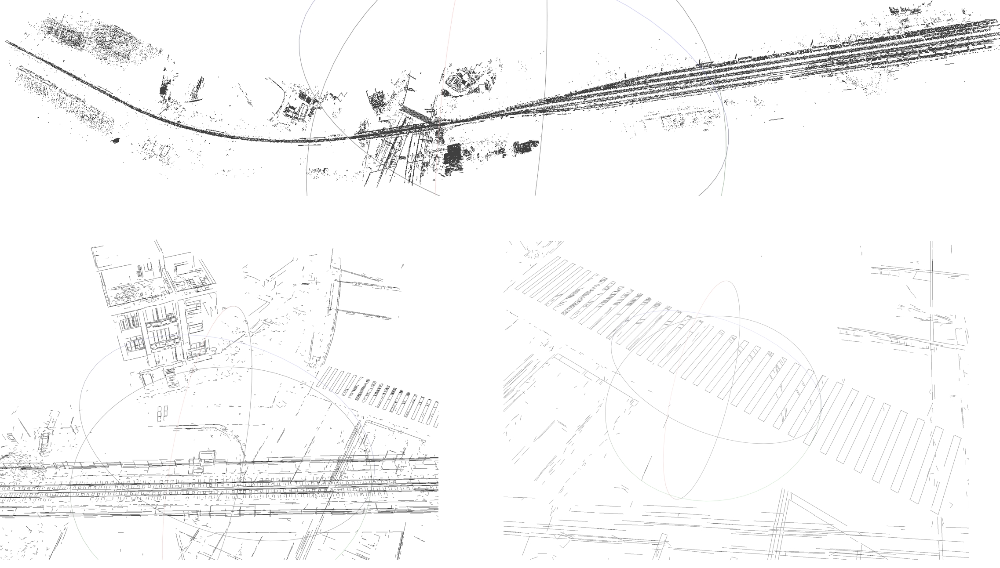

<!-- Row 1: 两张图 -->

  <table>
    <tr>
      <td align="center" width="45%">
        
      </td>
      <td align="center" width="45%">
        
      </td>
    </tr>
    <tr>
      <td colspan="2" align="center">
        <b>Reconstruct with 30 images (3072 ✖ 2048) Line detector-LSD </b>
      </td>
    </tr>
  </table>

<table align="center" style="margin-top: 20px;">
  <tr>
    <td align="center">
      
    </td>
  </tr>
  <tr>
    <td align="center">
      <b>Reconstruct with 259 images (8192 ✖ 5460) Line detector-LSD</b>
    </td>
  </tr>
</table>

<table align="center" style="margin-top: 20px;">
  <tr>
    <td align="center">
      
    </td>
  </tr>
  <tr>
    <td align="center">
      <b>Reconstruct with 459 images (11648 ✖ 8736) Line detector-AG3line</b>
    </td>
  </tr>
</table>

